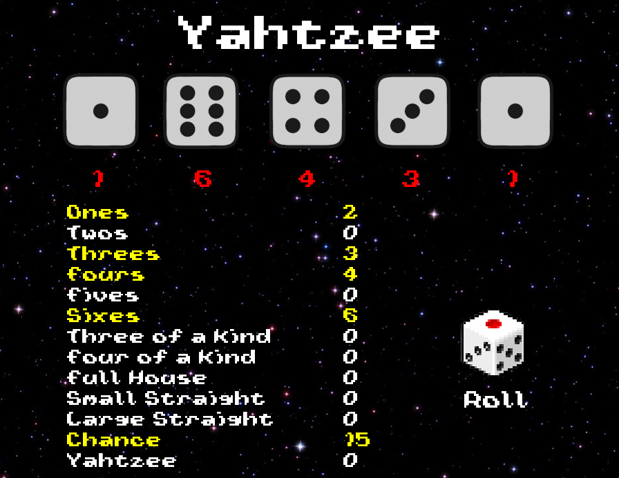

# Yahtzee Game

## Table of Contents

- [Description](#description)
- [Screenshots](#screenshots)
- [Built With](#built-with)
- [Getting Started](#getting-started)
  - [Prerequisites](#prerequisites)
  - [Installation](#installation)
- [Usage](#usage)
- [License](#license)
- [Contacts](#contacts)

## Description

A gambling game of dice. 5 dice with numerical values from 1 to 6 are used for the game. Depending on the game situation, from one to five dice are thrown at the same time. Points are given for completing certain combinations. All combinations and the results of their execution are recorded in the table. The goal of the game is to score the highest amount of points. Dice can be blocked to save the desired result. 3 throw attempts are given for one move. At the end of the game, the sum of all points is calculated.

## Screenshots

## Built With

## Getting Started

“Ones”

“Twos“

“Threes“

“Fours“

“Fives“

“Sixes“

The lower part: Has the following options, which bring either a fixed number
of points regardless of the dignity, or the number of points is the sum of all the dice dropped:

“Threes“ – 3 cubes with the same value (example: 5-5-5-2-4 = 21 points) – the sum of all cubes

“Square“ – 4 cubes with the same value (example: 1-1-1-1-3 = 7 points) – the sum of all cubes

“Full House" – 3 dice with one value + 2 with another (example: 2-2-2-3-3) – 25 points

“Small Street" – 4 cubes with values in order (example: 2-3-4-5-5) – 30 points

"Big Street" – 5 dice with values in order (example: 2-3-4-5-6) – 40 points

“Ecci" – 5 dice with the same values (example: 3-3-3-3-3) – 50 points

"Chance" – Any combination (example: 2-3-5-6-6 = 22 points) – the sum of all dice.

Using the “Chance” column is useful if your combination does not fit into any other
(either they are already occupied, or you don't want to use them) but you are sorry to lose the discarded
values.
Important notes:

The player can roll the dice up to 3 times, each time you can put down the dice and throw the rest
(an arbitrary number from 1 to 5), or not throw the dice and stop at the
combination that is.

At the end of the discards, the player must write down his result in the table - in any graph at his
discretion (unless, of course, the dropped value is suitable for the graph). The result of the throw cannot be
skip and don't write anything down. Even if the result does not fit into any graph (or
suitable graphs are already occupied), the player writes "0" to any graph of his choice.

There can be only one value in each graph

### Prerequisites

The program only works on Windows!

### Installation

Does not require additional installations

## Usage

Start - the space bar button

Roll the dice - the space bar button or left-click on the Roll icon

Block Cubes/Choosing a combination - left mouse button

## License

For free! No license required

## Contacts

  
